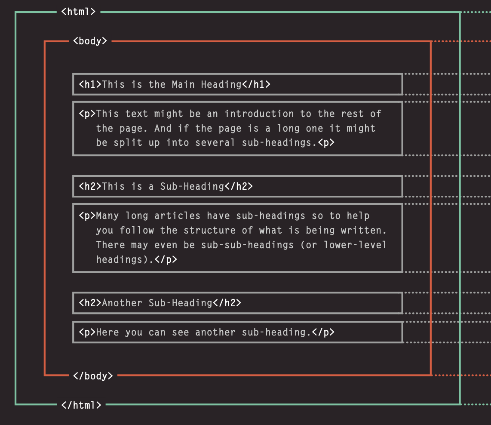
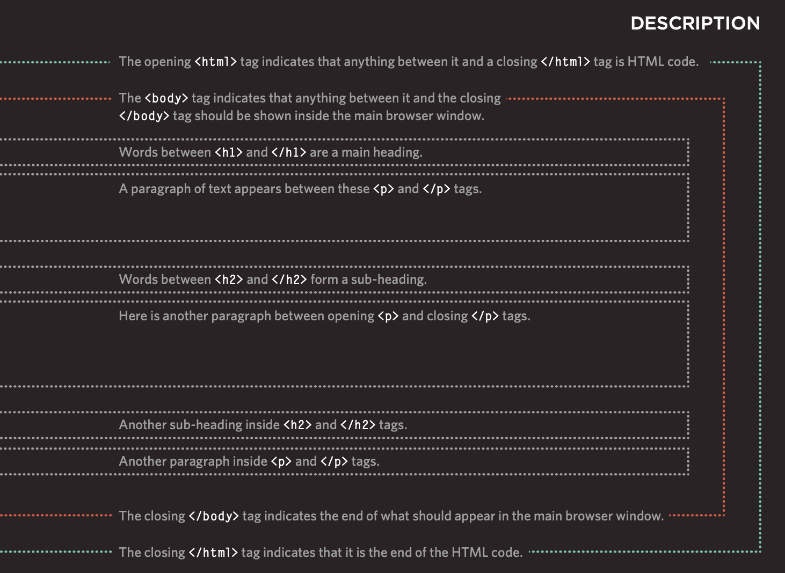
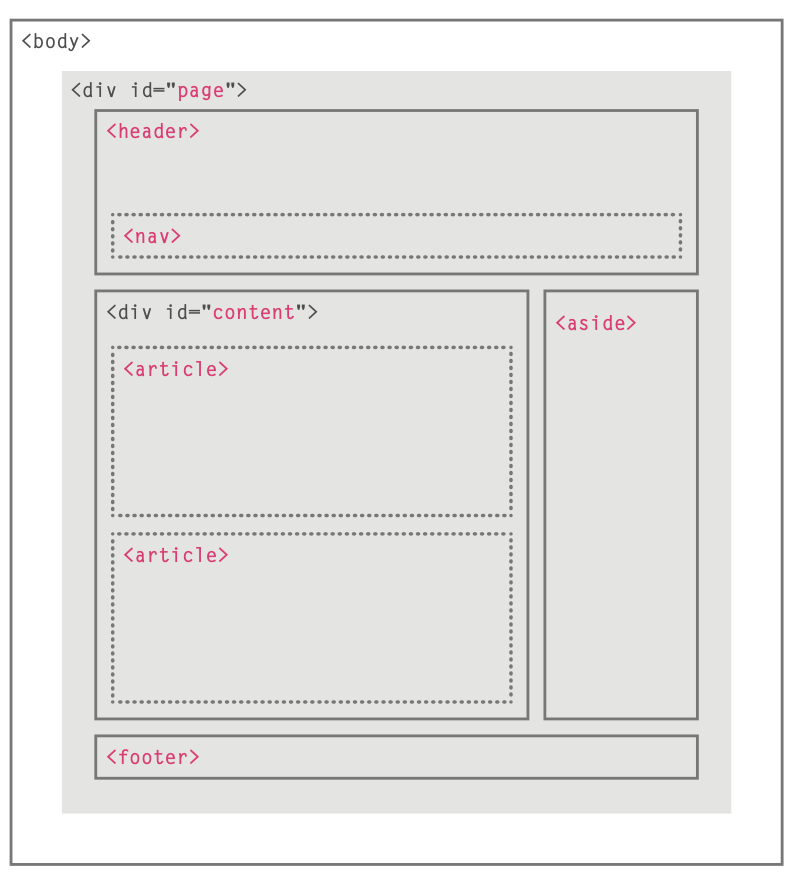

# HTML & CSS

## HTML Structure
```
<html>
  <body>
    <h1>This is the Main Heading</h1>
    <p>This text might be an introduction to the rest of
    the page. And if the page is a long one it might
    be split up into several sub-headings.<p> <h2>This is a Sub-Heading</h2>
    <p>Many long articles have sub-headings so to help
    you follow the structure of what is being written. There may even be sub-sub-headings (or lower-level headings).</p>
    <h2>Another Sub-Heading</h2>
    <p>Here you can see another sub-heading.</p> </body>
</html>
```


### HTML Layout



## Extra Markup 

##### Doctype attribute
- `<DOCTYPE>` attribute denotes which version of HTML you are using

##### Comments
- `<!-- COMMENT  -->` that is visible in code but will not be visible on browser

##### Id attribute
- Uniquely identifies element

##### Class attribute
- Identifies groups of elements 

##### Block vs inline elements
 - Block elements take up the entire line: `<h1>`, `<p>`, `<ul>`, and `<li>`.
- Inline elements appear on the same line with other elements: `<a>`, `<b>`, `<em>`, and ``.

##### Grouping text
- `div` groups elements together
- `span` groups elements together *inline*

##### Meta data
- Contains information about the webpage for the browser
- Typically contains a description, keywords, author, etc
