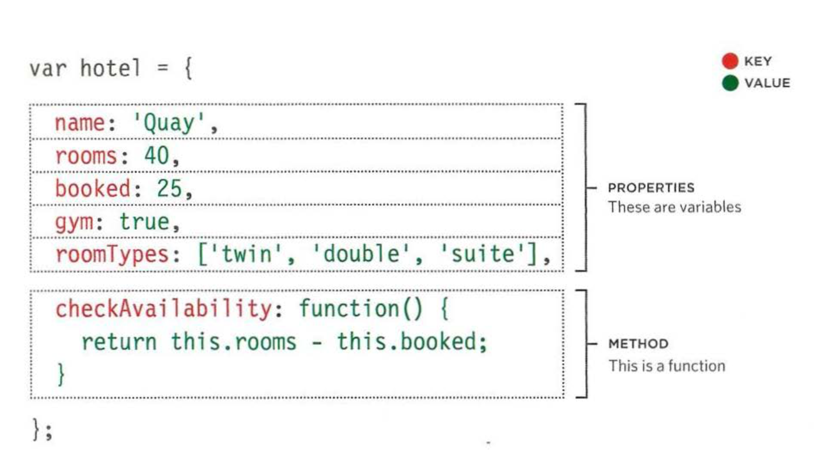
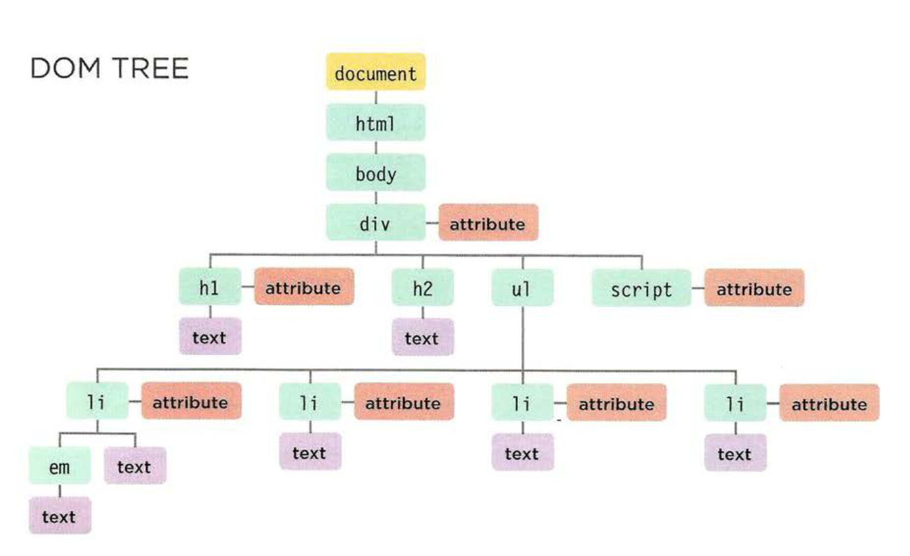

# JavaScript Objects
Objects group together a set of variables and functions

In an object, variables and functions take on new names:
- Variables = properties
- Functions = methods

Objects contain key and value pairs


## Objects can be created using **literal** notation or **constructor** notation

### Literal notation
```
var hotel = {
  name: 'quay',
  rooms: 40,
  booked: 25,
  checkAvailability: function() {
    return this.rooms - this.booked;
  }
}
```


### Constructor notation
```
var hotel = new Object ();

hotel.name = 'quay';
hotel.rooms = 40;
hotel.booked = 25;

checkAvailability = function() {
  return this.rooms - this.booked;
};
```

And are accessed using dot notation
```
var hotelName = hotel.name;
```
Or by using square brackets:
```
var hotelName = hotel['name'];
```
# Document Object Model
The **DOM** specifies how browsers should create a model of an HTML page and how JavaScript can access and update the webpage while it is in the browser.

As a browser loads a webpage, it creates a model of that page called the **DOM tree**.

The **DOM tree** is made up of objects, each representing a different part of the page loaded in the browser, and consists of **four nodes**:

- Document Nodes
- Element Nodes
- Attribute Nodes
- Text Nodes



### **Accessing and updating the DOM involves two steps:**

### Step 1: Access the elements 

**DOM Queries**: Select an individual element node or select multiple elements 
- `getElementById()`
- `querySelector()`
- `getElementByClassName()`
- `querySelectorAll()`
    
**Traverse the DOM**: Move from one element node to a related element node
- `parentNode`
- `previousSibling`
- `nextSibling`
- `firstChild`
- `lastChild`


### Step 2: Work with those elements
- Access/update text nodes
- Work with HTML content
- Access or update attribute values

## DOM queries
Methods to find elements in the DOM tree are called **DOM queries**
```
document.getElementById('one')
```

When a DOM query can return more than one element, it returns a **NodeList**

A **NodeList** is a collection of element nodes, each with an index number

*Note: they look like array's but are not actually arrays; they are a type of object called a **collection***

There are:
- Live NodeList's
- Static NodeList's

To select an element from a NodeList, index into the collection using square brackets, just like you would an array

## Changing content in the DOM tree

There are two approaches to adding or removing content from the DOM tree:
- **innerHTML**: involves security risks
- **DOM Manipulation**: is safer but requires more code and is slower

DOM manipulation easily targets individual nodes in the DOM tree whereas innerHTML is better suited for updating entire fragments.

### innerHTML

1. Store new content as a string inside a variable
2. Select the element whose content you want to replace
3. Set the element's innerHTML property to be the new string


### DOM Manipulation

1. Use a DOM method to create an element and text node
2. Attach them to the DOM tree or remove the from the DOM tree

Once you have an element node, you can use other properties and methods on that element node to access and change it's attributes