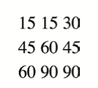

# Domain Modeling

## The process of creating a conceptual model in code for a specific problem

To define the same properties between many objects, use the **contstructor function**

The constructor function is defined using a **function expression**

```
var EpicFailVideo = function(epicRating, hasAnimals) {
  this.epicRating = epicRating;
  this.hasAnimals = hasAnimals;
}

var parkourFail = new EpicFailVideo(7, false);
var corgiFail = new EpicFailVideo(4, true);

console.log(parkourFail);
console.log(corgiFail);
```
Here `EpicFailVideo` is declared and assigned a function with two parameters.

When the function is called, the data inside these parameters is stored inside the `this.epicRating` and `this.hasAnimals`.  Storing data within properties ensures any newly created object can acess that data later.

The two objects are then **instantiated** with the `new` keyword and their properties are **initalized** by calling the `EpicFailVideo` constructor function.  After being instantiated and initalized, these objects are stored within the `parkourFail` and `corgiFail` variables.

As a result, two newly created objects are logged to the console. 

### This is **object oriented programming** in JavaScript in its simplist form
1. The `new` keyword instantiates (creates) an object
2. The constructor function initalizes properties inside that object using the `this` variable
3. The object is stored in a variable for later use

*For a more detailed explanation, read [this](https://github.com/codefellows/domain_modeling#domain-modeling).*


# HTML Tables

A table represents information in a grid format

Basic table structure:
```
<table>
  <tr>
    <td>15</td>
    <td>15</td>
    <td>30</td>
  </tr>
  <tr>
    <td>45</td>
    <td>60</td>
    <td>45</td>
  </tr>
  <tr>
    <td>60</td>
    <td>90</td>
    <td>90</td>
  </tr>
</table>
```
which will result in: 


You can make cells of a table span more than one row or column using the `rowspan` and `colspan` attributes

# JavaScript Objects Ctd

In JavaScript, data is represented using name/value pairs.
To organize your data, you can use an array or object to group a set of related values. In arrays and objects the name is also known as a key.

Variables have just one key and one variable name whereas objects and arrays have multiple keys and multiple objects. 

If you want to access an items location based off a property name (**key**), use an object.  If you want to access an items location based off its location (**index**), use an array. 

*Note: array's **are** objects*

See [class 06](./class-07.md) notes for details on objects. 